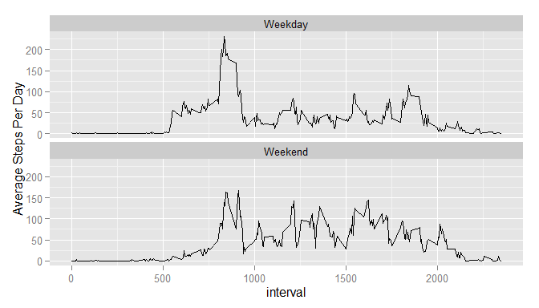

# Reproducible Research: Peer Assessment 1

##Loading and preprocessing the data

```r
library(dplyr)
library(ggplot2)

activityData <- read.csv("activity.csv")
isvalidData <- complete.cases(activityData)
activityData <- activityData[isvalidData,]
```

##What is mean total number of steps taken per day?

###Calculate the total number of steps taken per day

```r
stepsPerDay <- group_by(activityData, date) %>% na.omit() %>% summarize(totalStepsPerDay=sum(steps))
head(stepsPerDay)
```

```
## Source: local data frame [6 x 2]
## 
##         date totalStepsPerDay
##       (fctr)            (int)
## 1 2012-10-02              126
## 2 2012-10-03            11352
## 3 2012-10-04            12116
## 4 2012-10-05            13294
## 5 2012-10-06            15420
## 6 2012-10-07            11015
```

### Make a histogram of the total number of steps taken each day

```r
ggplot(stepsPerDay,aes(x=totalStepsPerDay))+ geom_histogram() + xlab("Steps Per Day") + ggtitle("Steps Per Day")
```

 

###Calculate and report the mean and median of the total number of steps taken per day

Total Number of Steps Per Day: Mean

```r
mean(stepsPerDay$totalStepsPerDay)
```

```
## [1] 10766.19
```

Total Number of Steps Per Day: Median

```r
median(stepsPerDay$totalStepsPerDay)
```

```
## [1] 10765
```

##What is the average daily activity pattern?

###Plot the 5 minute interval and average number of steps taken for all days

```r
intervalPerDay <- group_by(activityData, interval) %>% na.omit() %>% summarize(meanStepsPerInterval=mean(steps))

ggplot(intervalPerDay,aes(x=interval, y=meanStepsPerInterval))+ geom_line() + xlab("Interval") + ylab("Average Steps") + ggtitle("Average Steps and Time Interval")
```

 

###Which 5-minute interval, on average across all the days in the dataset, contains the maximum number of steps?

```r
maxSteps <- which.max(intervalPerDay$meanStepsPerInterval)
maxSteps <- intervalPerDay[maxSteps,]
print(maxSteps)
```

```
## Source: local data frame [1 x 2]
## 
##   interval meanStepsPerInterval
##      (int)                (dbl)
## 1      835             206.1698
```
The 5-minute interval that contains the max number of steps is: 835

##Imputing missing values

###Calculate and report the total number of missing values in the dataset (i.e. the total number of rows with NAs)

```r
allActivityData <- read.csv("activity.csv")
totalMissingValues <- sum(is.na(allActivityData$steps))
print(totalMissingValues)
```

```
## [1] 2304
```

###Fill in the missing values of the data set
I opted to fill in the missing values with the mean of the time interval the missing value was related to

```r
mergedActivityData <- merge(allActivityData, intervalPerDay)

allActivityData <- group_by(mergedActivityData, date) %>%
  mutate(steps=replace(steps, is.na(steps), meanStepsPerInterval)) %>% 
  summarize(totalStepsPerDay=sum(steps))

head(allActivityData)
```

```
## Source: local data frame [6 x 2]
## 
##         date totalStepsPerDay
##       (fctr)            (dbl)
## 1 2012-10-01         10766.19
## 2 2012-10-02           126.00
## 3 2012-10-03         11352.00
## 4 2012-10-04         12116.00
## 5 2012-10-05         13294.00
## 6 2012-10-06         15420.00
```

###Make a histogram of the total number of steps taken each day

```r
ggplot(allActivityData,aes(x=totalStepsPerDay)) + geom_histogram() + xlab("Steps Per Day") + ggtitle("Steps Per Day ")
```

 

###Calculate and report the mean and median total number of steps taken per day

Total Number of Steps Per Day: Mean

```r
mean(allActivityData$totalStepsPerDay)
```

```
## [1] 10766.19
```

Total Number of Steps Per Day: Median

```r
median(allActivityData$totalStepsPerDay)
```

```
## [1] 10766.19
```

### Do these values differ from the estimates from the first part of the assignment? What is the impact of imputing missing data on the estimates of the total daily number of steps?

The mean of the two data sets are the same (10766.19) while the median for the data set where the missing values were populated was larger(10766.19 vs 10765).

All in all the impact to imputing missing data is minimal.

##Are there differences in activity patterns between weekdays and weekends?

###Create a new factor variable in the dataset with two levels - "weekday" and "weekend" indicating whether a given date is a weekday or weekend day.


```r
dayofWeekData <- group_by(mergedActivityData, date) %>%
  mutate(dayOfWeek=weekdays(as.Date(date)))  %>%
  mutate(dayType = ifelse(dayOfWeek %in% c('Saturday','Sunday') , "Weekend", "Weekday")) %>%
  mutate(steps=replace(steps, is.na(steps), meanStepsPerInterval))  %>%
  group_by(interval, dayType) %>%
  summarize(meanStepsPerDay=mean(steps))

head(dayofWeekData)
```

```
## Source: local data frame [6 x 3]
## Groups: interval [3]
## 
##   interval dayType meanStepsPerDay
##      (int)   (chr)           (dbl)
## 1        0 Weekday      2.25115304
## 2        0 Weekend      0.21462264
## 3        5 Weekday      0.44528302
## 4        5 Weekend      0.04245283
## 5       10 Weekday      0.17316562
## 6       10 Weekend      0.01650943
```

###Plot the 5-minute interval and the average number of steps taken, averaged across all weekend or weekdays days.


```r
ggplot(dayofWeekData,aes(x=interval, y=meanStepsPerDay)) + geom_line() + facet_wrap(~dayType, ncol=1) + ylab("Average Steps Per Day")
```

 
